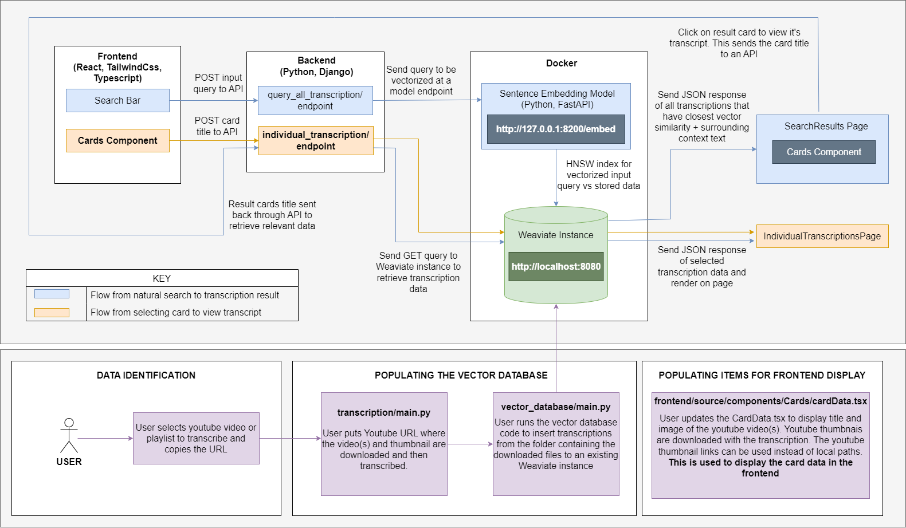

# Offline Vector Database for Search

## Demonstration Video:
Link: https://youtu.be/1Rlz3VlKcsk

## Description

This repository contains code to build a web application to search Transcriptions using Weaviate.. The main intent is to provide users with an interface for offline (or online if deployed) vector database that they can use to perform searches independently. The backend uses Django for an API, another dockerized API for sentence-embedding to vectorize text, as well ass code to allow for the downloading of youtube videos and subsequent transcription (found in a google colab for faster speed).

## Purpose
Inspiration for this comes from: https://www.hubermantranscripts.com/ where many aspects are similar however I bring my own spin on reverse engineering how this is built so that other people (with development backgrounds) can spin this up. At it's foundation, this application acts as a database for users to easily search through content. For my use case and demonstration, I target the user being a student who wants to quickly identify transcribed lectures.

## Features
- Natural language search functionality using Weaviate as the vector database.
- Keyword/phrase search in transcripts with highlighting
- Time search in transcripts with highlighting
- Dockerized FastAPI of the sentence-embedding model that can be hosted elsewhere for scalability
- Insert transcripts to a weaviate instance via CLI Python scripts
- Download and transcribe youtube videos to be inserted to weaviate instance via CLI or through the supplied notebook. (Needs manual editing by user)

<h2>System Design</h2>

This system design is based off of what has been done and what needs to be done. It includes features and how things talk to each other.

## Transcription Google Colab
Use this google colab: https://colab.research.google.com/drive/14b3hoXzVUB1BwA1PLi59hpPzcPQin1l4?usp=sharing to download and transcribe videos from youtube which you can then use to populate the database with.

## Medium Article
https://medium.com/@cluu.codes1337/how-i-made-a-complete-vector-search-web-application-with-weaviate-d88e3b667bb
